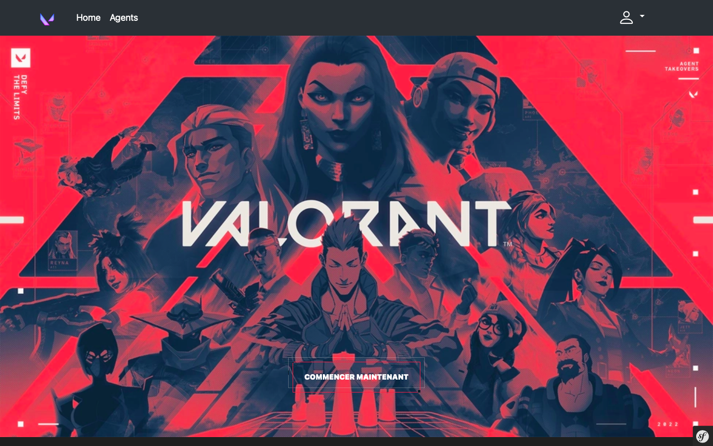
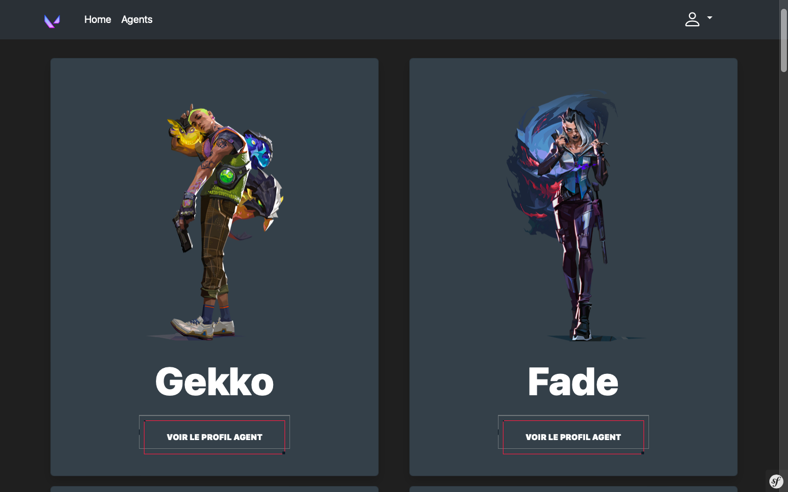
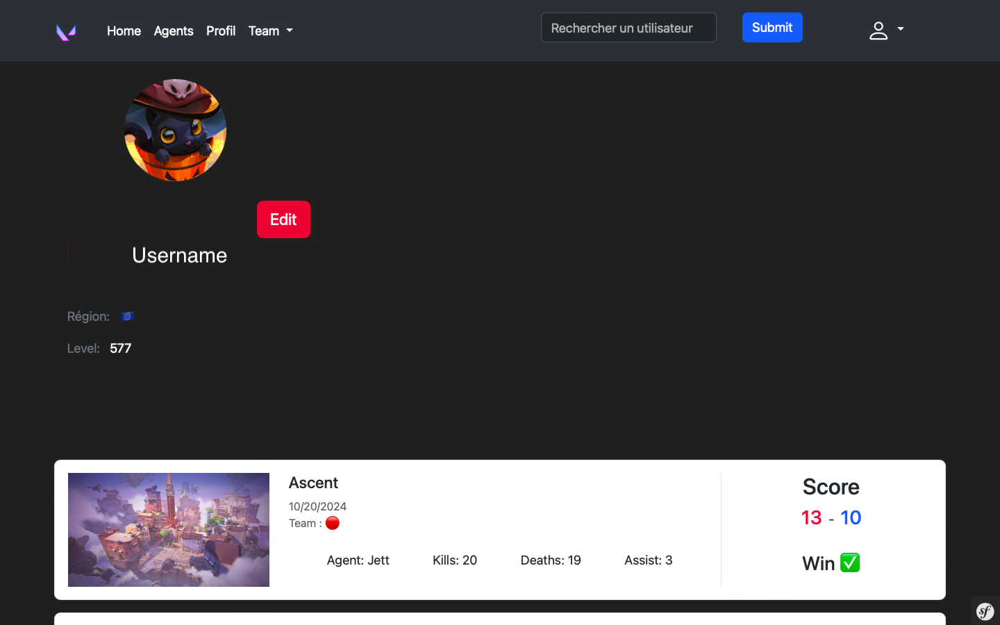

# BIENVENUE SUR MYVAL

⚠️ Lors de la connexion une erreur va apparaitre ceci est du à un changement de donnée de l'API il n'envoient plus les cards du user

Ceci est mon projet symfony, MyVal qui reprends les données de deux API afin d'avoir les données des agents voici celles-ci : https://valorant-api.com Et celle pour recupérer les données de l'utilisateurs avec leur Pseudo et tag voici l'autre : https://api.henrikdev.xyz/

## CONFIGURATION ⚙️

Vous trouverez dans le dossier DataFixtures des données pré-configurés

Comme les images de maps, un user, ainsi que des images par défault

Si vous voulez avoir un aperçu sans vous inscrire voici les identifiants d'un utilisateur que j'ai créé : 

**_Email_**: test@test.com

**_MP_**: test1234

## UPDATE NECESSAIRES 🔜

- Mise en forme du Front 
- Possibilité de delete des membres en tant que Admin de team 
- Envoyer des demande par mail pour rejoindre une team 
- Meilleure gestion des erreurs
- Voir le profil d'un user après une recherche
- Refactoriser

## BARRE DE RECHERCHE 🔎
- [UserController.php: Traitement de la recherche](base.html.twig)
  
J'ai dû créer une barre de recherche accessible sur toutes les pages de mon site. J'ai donc décidé de créer un événement afin que la vue twig ne me renvoie pas d'erreur pour dire que le formulaire n'est pas connu. Avec cet eventsubscriber je renvoie le formulaire à toutes les vues, j'ai trouvé cela plutôt complexe et j'ai dû réaliser beaucoup de recherche sur celle-ci.

## RECUPERATION DES DONNÉES DE L'API ✉️
- [Service/CallApiService.php: Appel à l'api](index.html.twig)
  
Pour la récupération des données par l'API cela s'est plutôt bien passé ce qui a été plus compliqué c'était de transformer ces données en une entité malgré de nombreuses recherches je n'ai pas pu accomplir cela seul, avec l'aide de mon formateur ( Merci Lucas 😂 ) j'ai pu voir par quel procédé passer et comprendre le principe de désérialisation.
 
## SATISFAIT DU RESULTAT 😊

Je reste quand même satisfait de mon projet et pense le continuer en ajoutant du javascript par la suite ainsi que d'ameliorer la sécurité et le front.

## VISUEL DU SITE

## OUTILS 💻

Voilà ce que j'ai utilisé pour ce projet : 

 

